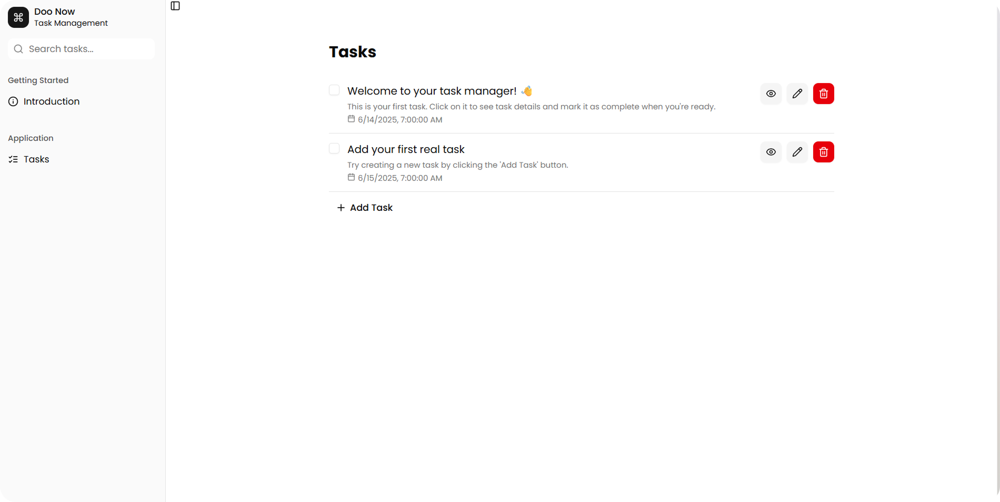
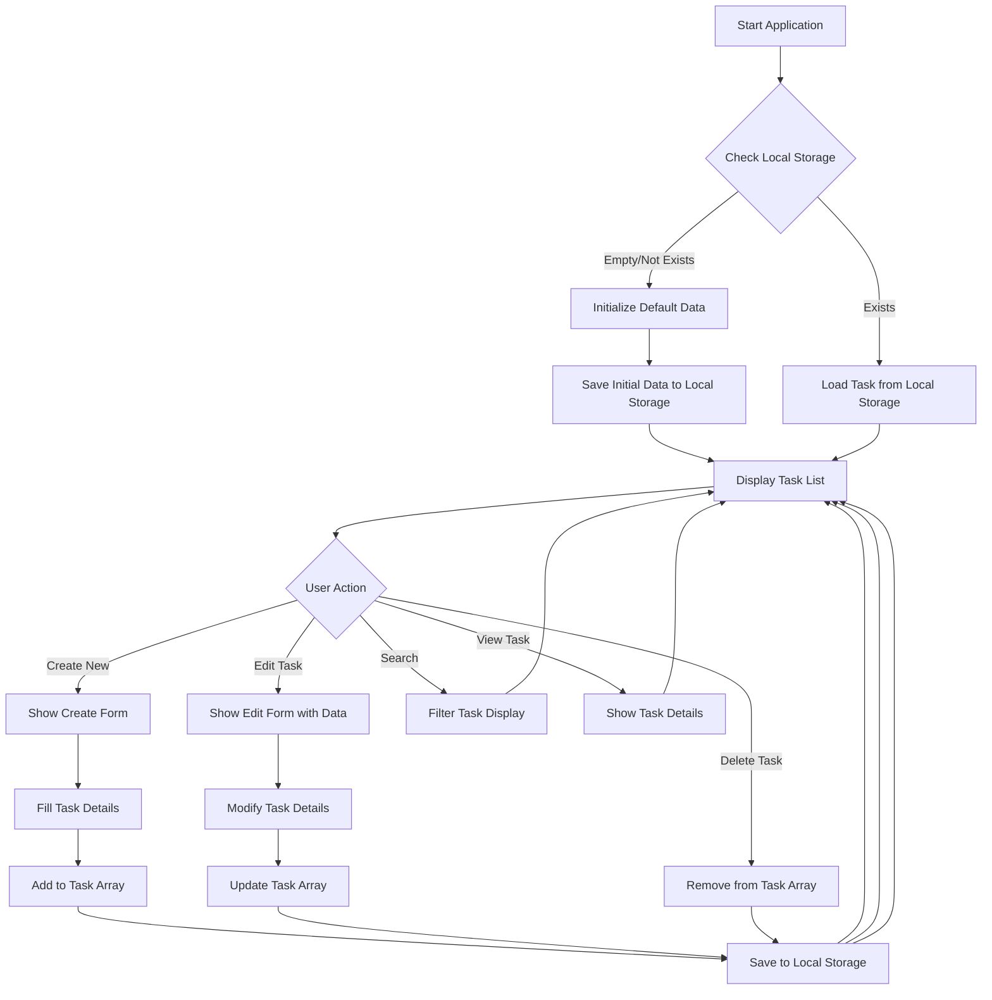

# Doo Now

> 📇 **Doo Now** - A simple task management application

Doo Now is an application designed to store and manage tasks. It serves as a digital task manager, allowing you to maintain your personal tasks.

## Links

- 🌍 URL: [https://doo-now.vercel.app/](https://doo-now.vercel.app/)
- 📦 Repository: <https://github.com/mchmdirvan/doo-now>

## Features

- ➕ Create Task
- 📖 Read Tasks
- ✏️ Update Task
- 🗑️ Delete Task
- 👤 Show Task Details
- 🔍 Search Tasks

## Tech Stack

- React Typescript
- Tailwind CSS
- Shadcn UI
- React Router
- React Hook Form
- Zod

## Flowchart

## References

Todoist: [https://todoist.com/](https://todoist.com/)
